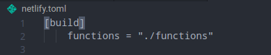
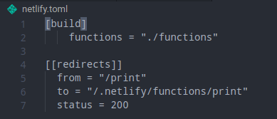

# :muscle: GymBot :muscle:

## Comandos

- **Compilar el proyecto:**
  > `npm run build`
- **Testear el código:**
  > `npm run test`
- **Comprobar el nivel de cobertura de los test:**
  > `npm run coverage`

## Serverless Computing

Se ha escogido Netlify ya que me resultó más cómodo durante la realización de los ejercicios y toda la configuración queda en un [fichero](netlify.toml), por lo que es fácilmente legible. Además, nos permite acortar las rutas de nuestros recursos.

La conexión entre el repositorio en GitHub y netlify está hecha mediante la interfaz web de netlify. Para ello, es tan sencillo como registrarse en netlify con tu cuenta de GitHub y darle los permisos que te vaya pidiendo como en el resto de plataformas con las que hemos trabajado durante el desarrollo del proyecto. En mi caso, solo le ha dado permisos sobre el repositorio de este proyecto.

Una vez en nuestro dashboard, haremos click en el botón _new site from Git_ y lo conectaremos con nuestro repositorio siguiendo los pasos.

Se nos habrá creado un proyecto con un dominio genérico, por lo que iremos a cambiarle el nombre a _Domain settings > Custom domains > Options > Edit site name_ y le pondremos el nombre de nuestro proyecto.

La configuración del despliegue se hace desde el fichero netlify.toml mencionado al principio.

Aquí podemos ver una configuración básica de Netlify, en la que especificamos la ruta de nuestra carpeta [functions](functions) en la que están las funciones que van a ser desplegadas en nuestro FaaS.

En este caso, he optado por incluir algo más de configuración, añadiendo una redirección para acortar la ruta a nuestra función y que sea más sencillo de acceder a ella. Este sería el resultado final:

Como función serverless se ha creado una [función](functions/print.js) que imprime el contenido del fichero [today.json](functions/today.json). En este fichero se almacena el resultado de la función `printToday()` de nuestra [rutina de ejemplo](assets/example_routine.ts) que imprimirá los ejercicios que nos toca realizar hoy. Estos datos se actualizan cada día a las 00:00 con una [GitHub Action](.github/workflows/updateToday.yml).

Nuestra GH Action preparará un contenedor de node en el que ejecutará el comando `npm run today` que ejecutará la función descrita en el párrafo anterior y pusheará los cambios a nuestro repositorio.

Un minuto después se lanza otra GH Action que actualiza el fichero [5.JSON](5.json) con los datos de netlify.

El resultado de la función se puede ver desde la [web](https://gymbot.netlify.app/print) o en este [fichero](5.json).

Se ha modificado el fichero [iv.yaml](iv.yaml) para que incluya la ruta de nuestro recurso.

## Avance del código

Aparte de lo mencionado arriba, se ha reformado el modelo [Routine](src/models/routine.ts) para hacerlo más entendible y sencillo de operar con él. Esta reforma ha implicado el borrado del modelo Daywork. Para poder realizar la función de print se ha añadido una función que transforma un ejercicio a string y otra que imprime los ejercicios de hoy de la rutina. Esta última es la que es llamada por `printToday()`.

## Documentación adicional

- [Configuración de git](docs/git-config.md)
- [Descripción del proyecto](docs/descripcion.md)
- [Pasos a realizar](docs/pasos.md)
- [Historias de usuario](docs/hu.md)
- [Herramientas utilizadas](docs/herramientas.md)
- [Configuración de docker](docs/docker.md)
- [Configuración de CI](docs/ci.md)
- [Problemas encontrados durante el desarrollo del proyecto y sus soluciones](docs/errors.md)
