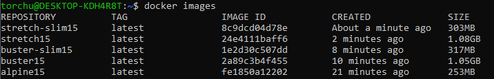
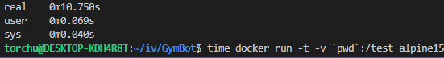
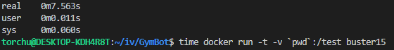
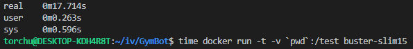
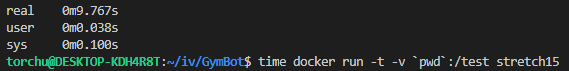
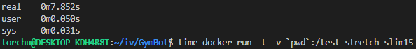

# Configuración de docker

## Creación del dockerfile

Lo primero será crear un [Dockerfile](../Dockerfile), siguiendo las mejores conductas, para crear nuestras imágenes y poder realizar después los tests pertinentes.

## Seleccionar la mejor imagen base para nuestro contenedor

Una vez ya sabemos que todo funciona como debería con una imagen cualquiera, probaremos a crear contenedores con distintas imágenes para decidir cuál es la óptima para nuestro proyecto atendiendo a su tamaño y velocidad.

Como para nuestro proyecto usaremos Node.js, usaremos las [imágenes oficiales](https://hub.docker.com/_/node/) de Docker para Node.js. De entre la lista de opciones, vamos a probar:
- 15.0.1-alpine3.11
- 15.0.1-buster
- 15.0.1-buster-slim
- 15.0.1-stretch
- 15.0.1-stretch-slim

Lo primero es crearlas con nuestro Dockerfile:

Como podemos observar, *stretch15* y *buster15* son considerablemente más pesadas que las otras, por lo que, a priori, no nos interesarían.  Para estar seguros y seguir con la búsqueda de la mejor imagen, ejecutaremos los test en todas y mediremos el tiempo que tarda cada una. Para ello utilizamos el comando ``time docker run -t -v `pwd`:/test <nombre_de_la_imagen>`` con todas las imágenes que hemos creado:

**15.0.1-alpine3.11**

**15.0.1-buster**

**15.0.1-buster-slim**

**15.0.1-stretch**

**15.0.1-stretch-slim**

A la vista de los resultados está que **stretch-slim** es la mejor imagen para nuestro contenedor, ya que es la segunda más ligera y la segunda más rápida. Las imágenes **buster** y **stretch** quedan descartadas, ya que aunque aportan una buena velocidad, pesan el triple que el resto de imágenes. Otra buena opción podría ser usar **alpine**, ya que no se queda atrás en velocidad y es más ligera que **stretch-slim**, pero en este caso, he decidido utilizar la segunda.

