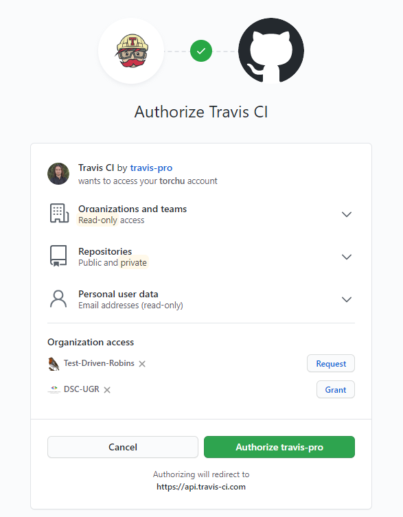
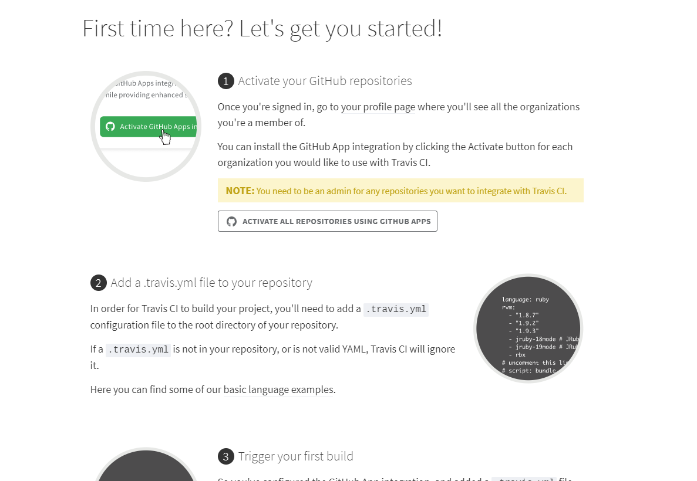
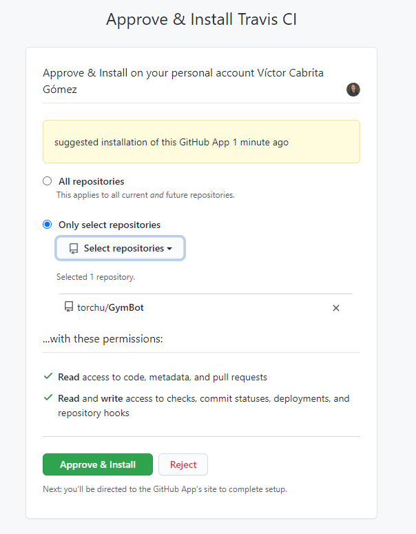
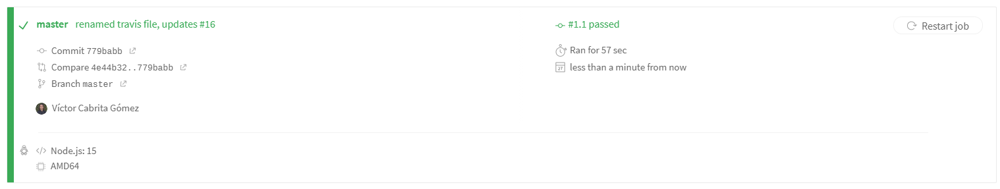

# Configuración de Travis

## Darse de alta en la plataforma

El primer paso consiste en darse de alta en Travis.

Cuando entremos a [Travis](https://travis-ci.com/) veremos un botón que nos dice "sign up". Clicamos en ese y en sign up with GitHub y nos saldrá algo como esto:

Para darle permisos, nos pedirá nuestra contraseña de GitHub y tras ponerla, ya tendremos nuestra cuenta creada.

## Activar Travis en nuestro [repositorio](https://github.com/torchu/GymBot)

Para ello, le damos al botón que dice "ACTIVATE ALL REPOSITORIES USING GITHUB APPS". Después podremos cambiar a la opción "Only select repositories" y seleccionar los repositorios en los que queramos integración continua, en este caso, nuestro repo del proyecto. Esto lo podremos cambiar más adelante para tener CI en más repositorios.

## Configurar Travis en nuestro repositorio

La configuración de travis se realiza mediante el fichero [.travis](../.travis.yml).

Como estamos usando Node.js en nuestro proyecto, abrimos la [guía](https://docs.travis-ci.com/user/languages/javascript-with-nodejs/) de Travis correspondiente. En nuestra configuración haremos que Travis pruebe con las dos últimas versiones de Node (14 y 15). También haremos que antes de que instale las dependencias instale la versión 7.0.7. de nuestro task manager (npm), ya que es la que estamos usando en el proyecto, y que instale jest y ts-jest, ya que son las dependencias utilizadas para testear el código.

Ahora configuramos nuestro [fichero](../.travis.yml) siguiendo la documentación.

Como podemos observar, todo funciona a la perfección.

